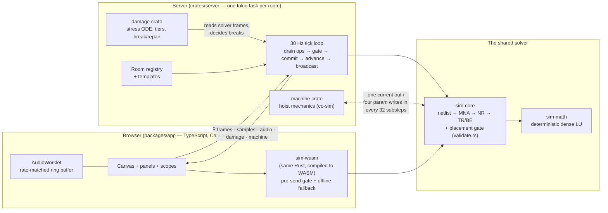
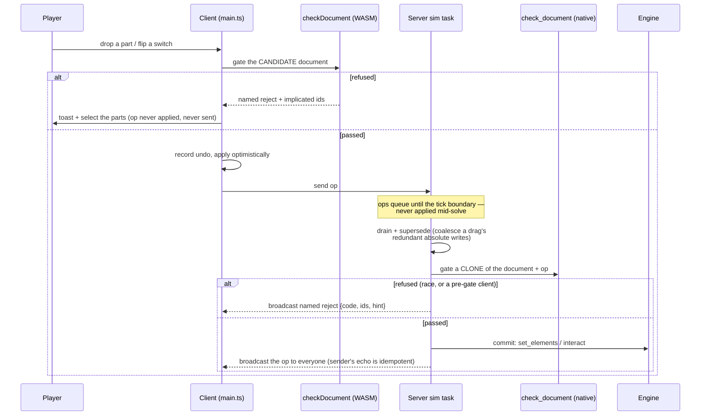

# Architecture — the machine as built

*Common Ground* is a multiplayer game where players draw electrical schematics on an
infinite shared canvas and a real circuit simulation — Modified Nodal Analysis,
Newton–Raphson, trapezoidal integration — runs authoritatively on the server. Every
number a player sees is a solver output. This document is the summary: read it first,
and you should be able to hold the whole system in your head. The detailed as-built
docs live in `docs/asbuilt_*.md`; the original *planned* architecture (29 July 2026,
written before most of this existed) is in `docs/arch_*.md`, and the [last
section](#the-plan-vs-the-product) says where the product diverged from it.

Everything here was verified against the code at commit `0475bbf` (main,
August 2026). Measured numbers carry their provenance; anything not verified says so
in place. This repo has shipped confidently wrong documentation before — a goal card
that asserted physics the solver disproves, a solver comment whose claimed
failure-at-step-0 measured as 0% at step 0 — so the standard here is: **checked, or
marked unchecked**.

---

## The four pillars

Everything else is a consequence of these. Each one is enforced by a specific
mechanism, not by policy:

1. **Every number a player sees comes from the solver.** No faked electrical
   behavior, ever. Enforced at the level of individual formulas: the op-amp's
   dissipation is computed from its solved output current and the rail it works
   against because its ideal model has no supply pins (`sim-core/src/engine.rs`);
   speakers are just resistors, and what you hear is samples of the matrix
   (`netlist.rs`: "nothing here makes sound"); the hoist's nameplate current limit
   is *read from the damage table* and shipped over the wire so the plate can never
   promise a limit the model doesn't enforce (`server/src/main.rs`,
   `motor_i_max`). The one audited exception list: audio gap concealment
   interpolates ≤250 ms of lost samples and reports itself as `concealedMs`, and
   the part-break "bang" is a sound effect quarantined on a separate audio bus so
   it can never enter the solver-sample pipeline (`sfx.ts`).

2. **The sim never stalls the UI.** Heavy circuits slow *sim time*, never the frame
   or tick rate. Enforced by shape: `Engine::advance(max_steps)` takes a step
   *count*, never a deadline — the caller (server tick, client offline loop) owns
   the wall-clock budget, and when the budget doesn't cover the tick's nominal
   substeps, sim time falls behind wall time. That dilation is then *surfaced*, not
   hidden: audio pitch drops with it and the dock says "sim 0.9×" (see
   [audio](#audio-is-solver-output)).

3. **Newton–Raphson failure ends in quarantine, never a panic.** A step that fails
   after the rescue ladder sets a flag and returns. There is no panic path in the
   step loop; malformed elements are dropped, stale audio taps read zero. Quarantine
   is sticky on purpose — see [who may clear it](#the-co-simulation-loop).

4. **`sim-core` is free of I/O, threads, clocks, and platform dependencies.** Its
   only dependencies are `sim-math`, `libm`, a hasher, and optional serde. This is
   what lets the *same* Rust compile to the server and to WASM in the browser and
   agree bit-for-bit — which is what makes several of the tricks below possible at
   all.

---

## The system map



The load-bearing edge is the one between `sim-wasm` and `sim-core`: the browser runs
the *identical* validation code the server enforces. Everything in the "shape of an
edit" section depends on it.

---

## The life of an edit

The design principle, stated in `sim-core/src/validate.rs` and enforced everywhere:
**a move that would break the simulation is an invalid move, refused with a named
reason — never tolerated and cleaned up after.** The server never says yes to
something it can't survive, and never says no without a name.



Three things to notice:

- **Prevent, don't revert.** A refused op is dropped *before* the optimistic apply,
  so there is nothing to roll back and no undo entry for an edit that never
  happened. Because the client's gate is the same compiled Rust, a server-side
  reject is only reachable via a race with another player, a document past the
  client's 800-element gate cap, or an old client. (Honest wrinkle: a comment in
  `net.ts` still says the sender "rolls back" on reject; the code only selects the
  implicated parts and toasts. Prevention is the design; the comment is stale.)
- **Two-phase commit on the server.** Every mutating path — edit, interact, repair,
  machine move — clones the element list, applies to the clone, gates the clone,
  and only then writes it back and touches the engine. The live matrix can no
  longer be corrupted by a placement, only refuse one.
- **The gate trials futures, not just the present.** It checks the document *as
  placed*, with *every switch closed*, and with *each source pinned at both
  extremes* — because a document that solves now but freezes when the hoist closes
  its own limit switch is a trap the player didn't set. Details, and the measured
  false-accept numbers, in [`docs/asbuilt_authority.md`](docs/asbuilt_authority.md).

---

## Time: one clock, four cadences

The engine's substep is **dt = 20 µs**, fixed. The server ticks at **30 Hz** with a
budget of **8 000 substeps per tick** (nominal is ~1 667, so the budget is ~5× — it
absorbs catch-up, not sustained overload). All faster streams are integer divisors
locked to the substep grid, so every consumer's samples land on exact common sim
times:

| cadence | every | rate | consumer |
|---|---|---|---|
| solver substep | dt | 50 kHz (sim time) | the matrix |
| speaker tap | 4 substeps | 12.5 kHz | AudioWorklet |
| probe sample | 16 substeps | 3.125 kHz | scopes |
| machine tick | 32 substeps (640 µs) | ~1.56 kHz | hoist co-sim |
| server tick | — | 30 Hz | ops, frames, damage, broadcast |

32 = 2×16 = 8×4: the tick loop advances in chunks of the finest cadence anyone
needs, and one inner loop serves all three streams without drift
(`server/src/main.rs`, the tick loop).

When a room is too heavy for its budget, **sim time dilates** — and because speaker
taps are real solver samples consumed at a fixed audio rate, dilation is audible as
*pitch*: a sim running at 0.9× plays the player's instrument flat. This is treated
as information, not a bug: the audio worklet slaves its playback rate to the
server-reported ratio and the dock displays it. A note for anyone quoting numbers:
`docs/plan.md` resolution 1 nominally specifies dt = 10 µs at a 60 Hz tick; the
built server runs 20 µs at 30 Hz, and every real-time ratio in the scale docs
belongs to the built configuration.

---

## The solver, in one paragraph each

Full detail: [`docs/asbuilt_solver.md`](docs/asbuilt_solver.md).

**There is no "net" object.** A net is an emergent equivalence class: element pins
are integer grid points, coincident points are the same junction, and wires and
grounds merge junctions by union-find. Ground's class becomes node 0, which has *no
row in the matrix* — a fact that quietly powers two other systems (exact island
decomposition, and the gate's per-block trials). Ideal sources get branch-current
unknowns, and *equal* constraints (two 5 V supplies in parallel, a supply and an
equal rail) are canonicalized and share one branch unknown instead of producing a
singular matrix — with quantized integer keys, not epsilon comparison, because an
epsilon compare isn't transitive and "same net" must be an equivalence relation.

**The numeric floor is deliberately boring.** `sim-math` is one dense LU with
partial pivoting, plain scalar f64 — no FMA, no SIMD, no fast-math, no platform
libm — because plain scalar IEEE-754 arithmetic is bit-identical on x86-64, aarch64
and wasm32. Its one clever line: a row update is skipped when the multiplier is
exactly zero, which is why a block-diagonal (many disconnected circuits) world
factors far cheaper than a connected one of the same size.

**The step loop is NR inside a rescue ladder inside a budget.** Linear circuits
solve in one pass. Nonlinear ones run Newton–Raphson (max 100 iterations) with
SPICE-style junction limiting; a failed step rolls back its snapshot and retries as
two half-size backward-Euler steps, recursively, up to 16× finer dt; final failure
sets `quarantined` and returns. Normal integration is trapezoidal; the first two
steps after any edit are backward Euler to kill ringing off the discontinuity.

**Piecewise-linear factor reuse** (merged): op-amps and 555s aren't smoothly
nonlinear — they are discrete-state devices whose matrix stamp is constant between
state flips, so the LU factorization survives across substeps and is invalidated
only when a region or latch actually flips. Measured ~2.7× on 555-plus-room
circuits (1.89× → 5.08× real time; Apple M4, release, `docs/scale-baseline.md`).
The classification is fail-safe by construction: `needs_newton` is *derived* as
`is_nonlinear && !is_discrete_nonlinear`, so a new device whose author forgets to
classify it costs speed, never correctness — and a golden test asserts reuse-on and
reuse-off produce bit-identical hashes.

**Determinism is an architectural constraint, not a virtue.** Pinned toolchain,
`libm`-only transcendentals, NaN canonicalization before hashing, BTreeMaps instead
of seeded hash maps anywhere iteration order matters, and a CI harness
(`tools/determinism.sh`) that runs the golden circuits 10 000 steps natively and
under wasm32 and diffs the state hashes bit-for-bit. What it buys: the client-side
gate that cannot disagree with the server, replay, and a future client preview that
cannot drift. What it forbids: GPU compute (also independently ruled out on
dispatch latency), fast-math, and any "just use a HashMap" convenience on a
solver-facing path.

---

## The co-simulation loop

The owner's named concept, and the most instructive boundary in the codebase. Full
detail: [`docs/asbuilt_cosim-machines.md`](docs/asbuilt_cosim-machines.md).

The Freight Hoist's mechanics are **not in the solver**. The electrical half is one
ordinary MNA element (a motor: resistance, inductance, and a back-EMF *parameter*).
The mechanical half is `crates/machine`: two state variables (rotor speed, platform
height), gravity, limit switches with 2 mm hysteresis — ~200 lines, no physics
engine, same determinism rules as sim-core.

```mermaid
sequenceDiagram
    participant E as Engine (dt = 20 µs)
    participant S as Server tick loop
    participant H as Hoist (h = 640 µs)
    loop every 32 substeps
        S->>E: advance(32) — last writes held constant
        E-->>S: pin_current(motor) — one solved branch current
        S->>H: tick(i, 640 µs) — integrate ω, y; latch limit switches
        H-->>S: Writes { bemf, wiper, lim_top, lim_bot }
        S->>E: 4 × write_param — take effect over the NEXT 32 substeps
    end
```

Why this shape:

- **The boundary sits exactly on the timescale gap.** The motor's fast electrical
  pole (L/R = 0.75 ms) stays *inside* the solver at 20 µs (integrated backward-Euler
  so it can't ring). Only the slow mechanical state (τ ≈ 25 ms) crosses, at 640 µs —
  a step 39× inside its time constant, which is why the mechanism's explicit Euler
  is stable. Couple much slower and the staggered exchange rings, then diverges;
  couple much faster and you pay per-write costs for no dynamic gain.
- **The interface is the document.** The machine talks to the circuit only through
  parameters of four ordinary elements a player wires to like any other part.
  Probes, damage, audio, and the client need no concept of "machine."
- **`write_param` is deliberately not `interact()`.** Interacts clear quarantine
  and re-arm the backward-Euler event steps — correct for a world event, fatal at
  1.5 kHz: it would resurrect a diverged circuit every 640 µs and hide the failure
  forever. Machine writes are a three-variant cost ladder (`Bemf`: RHS-only, free;
  `Wiper`: drops the factorization; `Switch`: full recompile, health flags carried
  across) and are the *only* netlist mutations that skip the gate — because
  refusing a limit-switch write would make the world lie about itself. The
  guarantee moves to placement time: the gate has already trialed the all-switches-
  closed document, so anything the mechanism can do to the topology was tried
  before the part was accepted.
- **The goal is measured, not asserted.** Win detection integrates solver current;
  the energy meter integrates solved source power. The goal card's physics claim was
  once wrong ("a constant voltage cannot hold the band" — false; 1.88352 V does,
  measurably) and is now stated correctly *and pinned by a server test*
  (`the_balance_voltage_holds_the_band_open_loop`).

---

## Damage: the server decides, from solver output

`crates/damage` reads the same per-element frames the room broadcasts — never
anything else — and integrates a normalized stress temperature per part:
`ds/dt = (heat − s)/τ`, solved with the ODE's *exact* solution (not Euler, because a
33 ms tick is not small next to an LED's τ = 0.35 s and a 1000× overload must break
the part, not the integrator). Heat is `load` for power-rated parts and `load²` for
current/voltage-rated ones, because that is what i²R is. Ratings are **per-instance
tiers**, not per-kind: a 0.25 W film resistor and a 5 W wirewound are the same
`Resistor` at different tiers, electrically identical, thermally nothing alike —
and tier is structurally prevented from ever reaching a matrix stamp. Breaking is
exactly one mechanism inside the solver: `set_broken` makes the part stamp nothing
(**failed open**), through the full recompile path. Clients receive `[id, stress,
broken]` rows and draw heat; they decide nothing. Detail in
[`docs/asbuilt_cosim-machines.md`](docs/asbuilt_cosim-machines.md).

---

## Audio is solver output

Speaker taps sample one element's terminal voltage every 4 substeps — a 12.5 kHz
stream of genuine matrix solutions — cross the socket as chunks stamped with sim
time, and land in an AudioWorklet ring buffer that a proportional controller holds
at 200 ms depth by trimming playback rate ±3 % (±51 cents — an emergency ceiling,
not an operating range; a 45 ms deadband keeps the 30 Hz chunk sawtooth from
frequency-modulating everything). When the sim itself dilates beyond the trim's
authority, the worklet *slaves* its base rate to the server-reported ratio: **a sim
at 0.9× plays flat**, on purpose, with the dock saying why. Nothing is synthesized;
the two audited exceptions (≤250 ms gap concealment, the sfx bus) are listed under
pillar 1. Detail in [`docs/asbuilt_client.md`](docs/asbuilt_client.md).

---

## Rooms, templates, and who owns what

One tokio task per room owns that room's Engine as a local variable — no lock, no
sharing, so a quarantined or saturated room dilates *its own* clock and nobody
else's. Rooms park after 30 empty seconds (the sim task exits entirely; the command
channel outlives it, so a join queues until resume), checkpoint atomically every
~5 s when dirty, and are limited to 64 as a runaway guard, not a design limit. A
**template is a whole room setup** — parts, panels, probes, scope channels, the
machine and its goal, the camera — not a netlist; a checkpoint and a template are
the same file format, so "save this room as a template" is one function (which
strips damage and re-arms the goal, so a template can't carry somebody's finished
game). Detail in [`docs/asbuilt_authority.md`](docs/asbuilt_authority.md).

The client owns what is genuinely per-player: camera, selection, undo, clipboard,
scope bench, panel window positions. Panel *membership* is never stored — an
element belongs to a panel iff every pin is inside its rect, recomputed each frame,
so there is no membership list to desync.

---

## The client's two bands, and machines as chips

Above `LOD_FULL` (6 px per grid unit) the client draws full schematic symbols.
Below it, a batched level-of-detail pass draws each part as a **neutral body with
per-pin colored legs** — because a part is *not* at one potential, and coloring a
whole glyph from pin 0 states something false (a 555 flooded with its VCC color
while TRIG swings is a lie). Voltages quantize into 17 buckets (odd, so 0 V is the
exact middle) purely for batching — thousands of parts collapse into ≤17 stroke
calls — while the values themselves still come from the solver frame. The planned
continuous crossfade to a "real-world device view" (`docs/arch_frontend.md`) is not
built; the hard threshold is what exists.

A **machine is presented as a chip**: a package with its pins on legs outside the
body — deliberately the 555's visual grammar — and its live physics drawn inside.
Its geometry is *measured, not declared*: every leg is placed at its child
element's own document pin, so a machine cannot put a leg anywhere but on its
terminal (the previous declare-and-hope version drifted; that bug class is now
unrepresentable). The presentation sits behind a registry seam
(`packages/app/src/machines/`) proven by a second implementation (a conveyor skin,
dev-flag only); the *server* half of a second machine still requires lifting a
known singleton assumption — the code says so itself. Detail in
[`docs/asbuilt_cosim-machines.md`](docs/asbuilt_cosim-machines.md).

---

## What is measured but NOT merged: islands

Today the world solves as **one matrix** — disconnected player builds share it
(`Engine::unknowns` says so in its doc comment). Partitioning into per-circuit
matrices is an *exact* decomposition, not an approximation: node 0 has no row, so
two circuits sharing only a ground symbol share no unknown. The benchmark harnesses
measure a **68× whole-substep win** on a 5 000-element many-district world and up
to 467× at 4 500 elements of golden tiles (Apple M4, release,
`docs/scale-baseline.md`, `docs/scale-parallelism.md`), with quiescence (skip
circuits that have gone static) and per-island local dt as the multipliers that the
3 000-element target actually requires — the measured per-element bookkeeping floor
means most of the world must not be *visited* at all. None of this runs in the live
solver yet: an integration branch (`wf/islands-integrate`) exists with no commits
beyond main at the time of writing. The same mathematics *is* already shipped in
one place: the placement gate judges documents one MNA block at a time. Detail in
[`docs/asbuilt_determinism-scale.md`](docs/asbuilt_determinism-scale.md).

Also honestly not built: WebGL renderer, semantic-zoom crossfade and world-band
faceplates, interest management, binary protocol, permissions/economy, op-log
persistence, the challenge ladder and tech tree (design docs only), sparse LU.

---

## The plan vs. the product

The three `docs/arch_*.md` files (29 July 2026) are the *planned* architecture.
They remain worth reading for intent, but they describe several mechanisms that
were built differently or not at all:

| Planned (arch_*.md) | Built |
|---|---|
| `sim-api`/`protocol` crates, binary three-class transport | JSON over one WebSocket broadcast channel; explicitly "M4-lite" |
| Room = tokio task + dedicated OS sim thread | One tokio task owns the Engine directly |
| 60 Hz tick, 1 kHz base substep, adaptive halving | 30 Hz tick, fixed 20 µs substep, per-tick step budget (halving exists only inside the rescue ladder) |
| Op protocol: `clientOpId`, rebase queue, per-property LWW, rollback on reject | None of it — optimistic apply + idempotent echo; conflicts *prevented* by the gate rather than merged |
| SQLite op-log; undo via inverse ops over the log | One JSON checkpoint per room; undo is client-local |
| Soft DRC: "warnings, not rejections" | The opposite, and stricter: hard electrical refusal with named reasons (the placement gate) |
| Islands + Bergeron transmission-line decoupling in the engine | Not merged; block decomposition lives in the gate only |
| Damage physics inside sim-core's commit phase; trip-to-open/short; fuses | A separate `damage` crate outside the solve path; breaking is always open; the i²t idea survived as the universal stress ODE |
| Motor as a self-contained back-EMF companion *device* | Co-simulation: mechanics in `crates/machine`, coupled through parameter writes — the machine layer, chip presentation, and goal are all post-plan |
| WebGL2 renderer, React-free worker topology, SAB frames, ULID ids | Canvas2D, single thread + AudioWorklet, JSON frames, numeric ids |

What survived unchanged: server-serialized ops at tick boundaries (the *decision*,
minus the machinery), rooms lifecycle create→active→parked→resumed→evicted
(`registry.rs` cites the plan's words), the determinism regime, quarantine, and the
step-budget rule.

---

## Where to read next

| Doc | What it explains |
|---|---|
| [`docs/asbuilt_solver.md`](docs/asbuilt_solver.md) | Drawing → matrix: wire closure, source merging, stamping, NR, rescue ladder, quarantine, PWL factor reuse, the device models' game-design constants |
| [`docs/asbuilt_cosim-machines.md`](docs/asbuilt_cosim-machines.md) | The co-simulation boundary, the hoist, machines-as-chips, the second-machine seam, damage |
| [`docs/asbuilt_authority.md`](docs/asbuilt_authority.md) | Trust model, op pipeline, the placement gate and its measured false-accept rates, rooms, templates, the hello contract |
| [`docs/asbuilt_determinism-scale.md`](docs/asbuilt_determinism-scale.md) | What bit-determinism buys and forbids; time and budgets; islands, quiescence, local dt — measurements and status |
| [`docs/asbuilt_client.md`](docs/asbuilt_client.md) | The render bands, per-pin coloring, interaction, panels/scopes, the audio chain end-to-end |
| `docs/plan.md` | The approved milestone plan (M0–M8) and binding resolutions |
| `docs/arch_*.md` | The 29 July planned architecture (see table above before trusting details) |
| `docs/scale-baseline.md`, `docs/scale-parallelism.md` | The scaling measurements quoted throughout |
