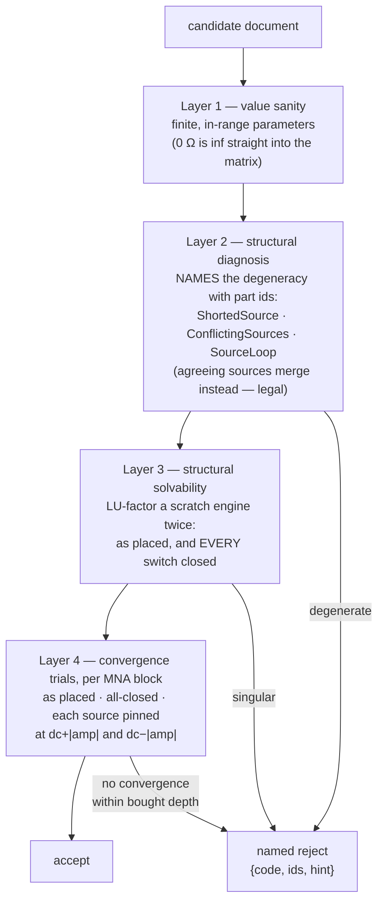
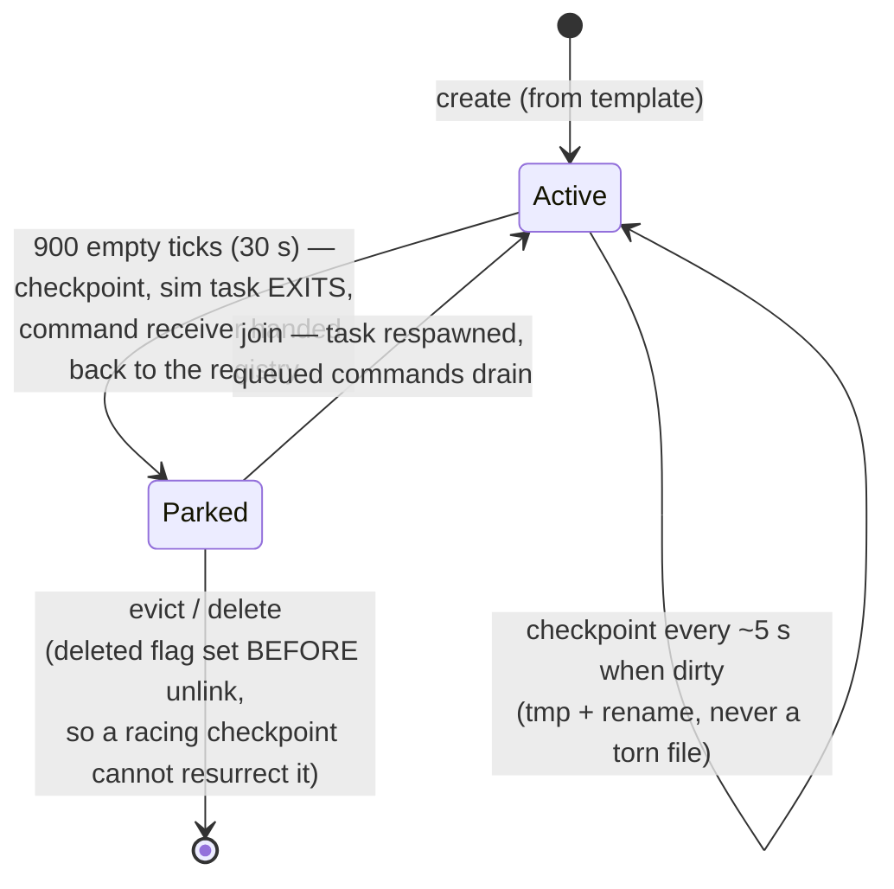

# As built: authority, the op pipeline, the placement gate, rooms

*Status: describes `crates/server` and the authority-facing halves of
`crates/sim-core/src/validate.rs` and `packages/app` at commit `0475bbf` (main,
August 2026). The planned counterpart is `arch_backend-netcode.md` (29 July); the
divergence table is at the end. The gate's false-accept percentages are in-code
records of fuzz-corpus measurements made during its development — attributed as
such, not re-run for this doc.*

The through-line of everything here: **the server never says yes to something it
can't survive, and never says no without a name.**

---

## 1. The trust model — who owns what

**Problem.** A shared world needs one authority, but making the server authoritative
for *everything* makes every camera pan a network round-trip, and making the client
authoritative for anything electrical violates pillar 1.

**The split, as built:**

| owner | state |
|---|---|
| Server (per room, one tokio task, sole owner of that room's `Engine` — no lock, no sharing) | the document, the solver, sim time, probes, panels (rects + names), the machine, damage, and the verdict on every mutation |
| Client (never sent to the server) | camera, selection, clipboard, undo/redo history, the in-place scope bench (localStorage per room code), panel *window* positions, which speaker it listens to |
| Derived, never stored | panel *membership* (an element belongs to a panel iff every pin is inside its rect, recomputed each frame — there is no membership list to desync) |

The client is "a renderer of server truth" (`net.ts`, first line). Its local WASM
sim is an *offline fallback*, not a running mirror: online, every number drawn
comes from server `frame`/`samples`/`audio`/`machine`/`damage` messages. Client
element ids cannot collide because the server-assigned player number partitions the
id space (`playerId × 1 000 000 + counter`). The only chrome that ever crosses the
wire is "save room as template," where the saving client's camera and scope seeds
travel in the POST body — because the server has never seen them.

There is no auth beyond an optional admin token on mutating lobby HTTP calls;
WebSocket ops carry none. Real sessions are milestone M4 work; the code says so.

## 2. The shape of an edit

The full sequence diagram is in [`ARCHITECTURE.md`](../ARCHITECTURE.md#the-life-of-an-edit);
here is what each stage is *for*:

1. **Client pre-send gate.** `editDoc` builds the candidate document the op would
   produce and runs `checkDocument` — the same Rust `sim_core::check_document`,
   compiled to WASM. A refusal selects the implicated parts and toasts the hint;
   the op is never applied, recorded in undo, or sent. **Prevent, don't revert.**
2. **Optimistic apply + send** if the gate passes.
3. **Tick-boundary drain.** The sim task drains every queued command at the top of
   the 30 Hz tick — ops apply between ticks, never mid-solve.
4. **Supersede.** Within one tick's batch, a drag's repeated *absolute* writes
   (`Move`/`SetValue`/`SetSwitch`) on one id keep only the last — provably
   invisible, because they are absolute — but only if nothing else in the tick
   touches that id. This exists because every command costs a full gate run, and a
   multi-part drag used to arrive faster than the tick could retire commands.
5. **Two-phase candidate-gate-commit.** For *every* mutating path — edit,
   interact, repair, machine move — the server clones the element list, applies
   the op to the clone, gates the clone, and only on success writes it back and
   updates the engine. A candidate that fails is never committed: the live matrix
   can no longer be corrupted by a placement, only refuse one. Syntactic garbage
   (unknown id, duplicate id, reserved fixture id, wrong pin count, >50 000
   elements) is silently dropped — those are client bugs or races, not placements
   a player can act on.
6. **Broadcast.** Success → the op goes to everyone including the sender (whose
   echo-re-apply is idempotent). Failure → a named `reject {who, code, id, ids,
   hint}`, mirroring `sim_core::Reject` in shape on both paths — machine-readable
   code, the primary part, *all* implicated parts (both halves of a conflict, a
   whole source loop), and a hint sentence written by the enum itself.

Interacts are gated identically — the server mirrors the engine's clamps into the
candidate so the gate judges the post-op document; on the client, an interact gates
*before* the optimistic apply, "so a refused switch flip never has to be rolled
back — it simply does not happen."

**Machine moves** are the special case: per-tick summed deltas applied as one
atomic translation of footprint plus fixture children, gated on a candidate like
everything else (a drag can park a closed limit switch across a player's source —
refused, the package stops following the pointer, the dragger is told why).
Hostile deltas are handled with checked/saturating arithmetic — a hostile delta
must be a dropped message, never a panicking sim task. The client mirrors the
server's world-limit and max-step constants so a drag cannot produce an op the
server refuses.

**Honest wrinkles, stated rather than smoothed over:**

- A `net.ts` comment says the sender needs the reject "to roll back its optimistic
  local apply." No rollback code exists; the handler selects and toasts. That is
  the *design* (prevention makes server rejects reachable only via races, the
  >800-element client cap, machine moves, or old clients), but in a genuine race
  the sender's optimistic apply stays applied locally until the next `hello`
  resnapshots the document. Designed behavior; stale comment.
- The four machine parameter writes are the one ungated mutation path, with the
  guarantee relocated to placement time — the full argument is in
  [`asbuilt_cosim-machines.md`](asbuilt_cosim-machines.md).

## 3. The placement gate

**The principle** (from `validate.rs`, which reads as a design essay and rewards a
full read): *an invalid move is a move that breaks the simulation* — decide whether
a document is solvable **before** it becomes the live netlist. One pure,
deterministic implementation; two callers (server pre-commit, client pre-send);
"the two sides can never disagree about what is placeable."

**Why an outcome-based check is not enough.** You could try the edit and revert on
failure — but by then the shared room has already frozen for everyone, or worse,
accepted a document that fails only when the *machine* closes a switch three
seconds later. And the gate's own history shows the naive version of "try it" is
confidently wrong: the old gate ran exactly one step, justified by a comment
claiming a freeze is "a DC operating-point failure, visible on the very first
step." The current code quotes that claim and refutes it with measurement: over
fuzzed documents that the old gate accepted and the engine then quarantined,
**0.00 % died at step 0 — median step 161, p90 step 2 601** (in-code record).

What each layer is *for* — "layer 2 exists to give a rejection a NAME; layer 3
exists to make sure a rejection HAPPENS":

- **Layer 2** proves rank deficiencies structurally (a source loop is ill-posed
  regardless of whether its voltages sum to zero, so no float compare is needed)
  and traces loop membership by BFS so the client can flash the whole cycle.
- **Layer 3's all-closed trial** covers all 2ⁿ switch combinations with one extra
  factorization, by a monotonicity argument: closing a switch only ever *adds* a
  0 V branch row and merges nothing, so singularity is monotone in the closed set
  — all-closed is the true worst case. This is also the machine-safety guarantee:
  the hoist's limit switches close with no gate in front of them, so the gate
  closes them first, at placement time.
- **Layer 4 exists because factorability is not solvability.** The shipped 9 V
  battery straight across the shipped LED factors perfectly; then Newton burns 100
  iterations, the rescue ladder exhausts itself, and the room quarantines —
  self-concealingly, since damage is skipped while quarantined, so the LED never
  even burns out. Reachable with two catalog parts in the first minute of play.
- **The source-extreme states are the cheap answer to time-varying drive.** A 9 V
  50 Hz sine across an LED fails at step 107 (CI-pinned by an exact assertion); a
  0.3 Hz version at step ~2 500 000 — hopeless to reach in the time domain. But
  the set of values a source takes is exactly [dc−|amp|, dc+|amp|], and pinning it
  there reaches the worst operating point in *one step*, at a cost independent of
  frequency. In-code records: the two extreme states alone catch 79 % of the
  accepted-then-frozen class — more than a 400-step time-domain trial (60 %) at
  1/400 the cost. Conservatism is one-sided and named: multiple sources are pinned
  at their extremes *simultaneously* even if their phases never align — may refuse
  a safe placement, never accepts an unsafe one. Convergence, unlike singularity,
  is not monotone, so the all-closed convergence trial is honestly labeled "a
  two-point sample of a space with 2ⁿ corners, not a proof."

**Headline number** (in-code record, 12 000 fuzzed documents, this tree, release):
the share of *accepted* documents that then quarantine within 5 000 steps fell
**0.67 % → 0.07 %** with the four-state trial. The survivors are deep transients
(median step 1 474) no affordable trial reaches — handled honestly by quarantine.

**Per-block trials — the islands mathematics, already shipped here.** Layer 4
judges one MNA block at a time. The exactness argument is the same one the islands
work rests on: node 0 has no row, so circuits sharing only ground share no unknown;
every (0,0) constraint was already refused as `ShortedSource`; Newton on a
block-diagonal system *is* Newton per block; and the rescue ladder only ever gives
a block a smaller step than it would take alone — "the verdict is the same, which
is the whole licence for doing this." Cost: Σnᵢ³ instead of (Σnᵢ)³. In-code
records: the whole gate at 400 elements went 42.9 ms → 0.91 ms; the shipped
147-element hoist room is 61 unknowns in 14 blocks whose biggest is 7 nodes
(9 unknowns — the two in-code comments count nodes and unknowns respectively).

**Depth is bought, not assumed.** Each block's trial depth comes from an integer
cost model (`block_step_cost(u) = 1 + u²/16` — integer arithmetic so every target
buys the same depth; the comment records that getting this *shape* wrong is what
let the old element-count ladder misprice by 30× in both directions) against
`TRIAL_BUDGET = 2560` step-units, with `TRIAL_CEILING = 4096` bounding the
mandatory one-step-per-block floor and `MAX_TRIAL_DEPTH = 256` capping any single
block. The calibration story is preserved verbatim in the comments: 2048
reproduced the four-state gate on 20 000 fuzzed documents; an adversarial corpus
found one 8-unknown document needing 218 steps that 2048 bought only 204 for; at
2560 the accepted set is identical to the unbudgeted gate — with a warning that
lowering it fails *silently*. The cliff this replaced: a cap keyed on element
count switched layer 4 off above 400 elements, so a 401-element room accepted an
AC-across-LED that a 400-element room refused — then quarantined at step 107. Now
nothing switches off; what a huge document gives up is depth on its *widest*
blocks only.

**What the gate deliberately accepts** — the philosophy's other edge: floating
subgraphs, dangling current sources, capacitor loops, inductor cutsets, parallel
motors, every *agreeing* arrangement of ideal sources. "Never reject a circuit the
engine can solve." Broken parts are validated as if healthy (repair can restore
them at any time). Trials run cold (t = 0), while a live edit keeps state — so a
document that only fails from a transient it already lived through is refused: the
safe direction, and the only one available to a pure function. And a *restored*
room document is never refused — it IS the room; a failing legacy save logs a
warning that the room may quarantine, instead of freezing mutely.

**The client's cap:** `GATE_MAX_ELEMENTS = 800` — the pre-send gate runs on the UI
thread, and past the cap the client relies on the server's refusal (the callout
arrives a round trip later; nothing becomes more placeable). The in-code cost table
(46 µs at 4 elements, ~0.9 ms at 400, 5.8 ms at 1200 — the residual wall is layer
3's two whole-document O(n³) factorizations) is an in-tree measurement whose
*predecessor* the comment itself confesses was wrong by 20×; not re-run for this
doc. One genuine asymmetry: the client gates at its local dt = 10 µs, the server
at 20 µs. Structural refusals (layers 1–3) don't depend on dt at all; the
convergence trial does, marginally — and the server has the final say either way.

## 4. Rooms: registry, parking, persistence

**Problem.** Many rooms, one process, and the real ceiling is solver time — so an
idle room must cost *nothing*, and one room's overload must never touch another's
clock.

**Mechanism** (`registry.rs`, which cites the plan's lifecycle words):

- **A parked room has no sim task at all** — it costs a struct and a JSON file.
  The command channel *outlives* the task: sends to a parked room queue until
  resume. The park decision and a join take the same lock, closing the
  parked-while-joining race.
- **Isolation is by construction:** one task owns one Engine, so a quarantined or
  budget-saturated room dilates its own sim clock and nobody else's.
  `MAX_ROOMS = 64` is "a guard against a runaway creator, not a design limit."
- **Failure honesty:** a room file that doesn't parse is logged and left alone —
  never silently replaced with a fresh demo. Graceful shutdown parks every live
  room (the old server lost up to 5 s of state on SIGINT). Room codes use a
  30-letter alphabet without 0/O/1/I/L/U, because codes get read aloud.

## 5. Templates are whole setups

**Problem.** "New room from template" must reproduce a *playable situation*, not a
bag of parts.

**Mechanism** (`templates.rs`): a template is a **whole room setup** — parts,
control panels, probes, scope channels, the machine and its goal, the camera. The
hoist template is not "four fixture parts"; it is the fixtures *plus* a DRIVE
panel *plus* an armature-current channel *plus* a height channel *plus* a scope
already showing both. Design consequences:

- **A checkpoint IS a template.** One `SaveFile` format serves both, distinguished
  by a `kind` tag, so "save this running room as a template" is one function —
  which strips damage and re-arms the mechanism, making "the template carries
  somebody's finished game" impossible.
- **Two sources, one list:** compiled-in builtins (`demo`, `hoist`, `showcase`,
  `synth`, `sandbox`) and `$EE_TEMPLATES/*.json` files, re-scanned on every
  list/resolve; a file id shadows a builtin. Adding a runtime template touches no
  code.
- **Machine-optional rooms are first-class:** `MachineSpec` is three-state on disk
  — absent (legacy, gets the hoist), `"none"` (no fixture ids, no machine
  telemetry, ever), or `"hoist"` with rect and state.
- **Templates are validated before the room exists** (`normalize()`: pin counts,
  duplicate ids, dangling probes dropped, rect sanitized) — a hand-edited file can
  never produce a room that arrives broken. The camera/scope `View` is
  deliberately *opaque* to the server: giving the server a schema for client
  chrome would be inventing replication this feature doesn't need.

## 6. The hello boundary

**Problem — and a shipped bug worth memorializing.** `JSON.parse` returns `any`.
The server writes `view` and `machine` at the hello's *top level*, beside `room`;
the client forwarded `m.room` alone; the TS interface declared fields it never
received; both halves compiled. A template's camera, seeded scopes, and goal card
"failed by simply not happening" for a release. Boundary fields don't fail loudly —
they fail by not happening.

**Mechanism, three layers:**

1. `parseHello` — the one place the wire becomes the client's shape; never throws;
   every mismatch becomes a `WireDrift` record surfaced as an in-world toast, not
   just a console line nobody has open.
2. A contract file neither half owns (`packages/app/src/wire/hello.contract.json`)
   listing the paths and a verbatim sample.
3. Both ends assert against it: a server test builds a real hoist room and checks
   the actual `hello_msg` output (including that there is no *second* copy of
   view/machine nested inside `room` — a fork waiting to disagree with itself),
   and the client's `wirecheck` drives the message through a stub socket into the
   real `connect()` switch — because the parser was never wrong; the line that
   chose what to forward was.

Tolerance is distinguished from drift: a pre-rooms server (no `room` key) is
supported and reported as null, honestly; view/machine nested inside `room` is
understood *and* reported as drift. Room switching is in-place, and
`resetForRoom` enumerates exactly the state that would be *wrong, not merely
stale*, in the next room — undo entries that would re-add a stranger's part,
pid-keyed traces, the latched goal card. A reconnect into the *same* room
deliberately does not reset.

## Divergence from `arch_backend-netcode.md` (the plan)

| Planned | Built |
|---|---|
| `protocol` crate; binary three-class transport with per-class queue policies | JSON over one broadcast channel — the header calls itself "M4-lite"; best-effort semantics come from broadcast lag-skip and self-describing chunks |
| Room = tokio task + dedicated OS sim thread + crossbeam | one tokio task owns the Engine directly |
| 60 Hz tick, 1 kHz base substep, adaptive halving | 30 Hz tick, fixed 20 µs substep, 8 000-substep budget |
| `clientOpId`/`baseVersion`/`seq`, rebase queue, per-property LWW, rollback on reject | none of it — optimistic apply + idempotent echo; conflicts are *prevented* by the gate, not merged; no rollback (see §2) |
| SQLite op-log + checkpoints; undo via inverse ops over the log | one JSON checkpoint per room; undo is client-local |
| `Welcome{docCheckpoint, opTail}`; client WASM sim reconciles continuously | `hello` carries the whole document; client sim is offline fallback only |
| interest management, viewport culling of streams | not built — every client gets the full frame |
| op validation = permissions + economy + soft DRC ("warnings, not rejections") | no permissions/economy; validation is the placement gate — hard refusal with named reasons, *stricter* than planned |
| rooms lifecycle, park-on-empty, 6-char codes, lobby HTTP | built essentially as planned |
| — (unplanned) | the template registry, machine-optional rooms, two-phase candidate-gate-commit, supersede, and the hello contract are all post-plan inventions |
