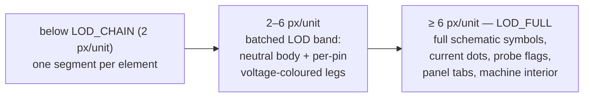
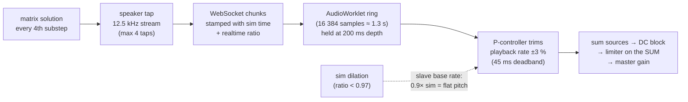

# As built: the client — rendering truth, and audio as solver output

*Status: describes `packages/app` at commit `0475bbf` (main, August 2026). The
planned counterpart is `arch_frontend.md` (29 July) — the built client is
architecturally simpler than the planned one on nearly every axis; the divergence
list is at the end. A handful of numbers below are in-code records of past
measurements (marked); the rest is verified against the code.*

The client is a single-threaded, framework-free Canvas2D renderer plus one
AudioWorklet. No React, no state library, no workers, no SharedArrayBuffer. Its
organizing idea is the first line of `net.ts`: **the client is a renderer of server
truth.** It computes presentation, never physics.

---

## 1. Three distinctions that organize all client state

**Shared vs. local.** Server-owned and replicated: the document, probes, panels
(rects + names), in-place scopes (rect + settings + channels), damage, machine
state, cursors, frames, sample/audio streams — wholesale replaced on `hello`.
Local and never sent: camera, selection, clipboard, undo, panel window positions,
a scope's autoscale hysteresis and trigger latch, dock state, volume.

The scope bench used to be on the local side of that line — a `localStorage`
record per room code. It read as replicated whenever the two clients under test
were two tabs of one browser (they share the store, so a reload showed the other
tab's change) and was not replicated at all between two players. It is room state
now: `hello.scopes` on join, `{"t":"scopes"}` on every change.

**Derived vs. stored — derive-per-frame is the house style.** Panel membership is
never stored: an element belongs to a panel iff *every* pin is inside the rect,
recomputed each frame — moving a part in or out rewires the panel live, and there
is no list to desync. Scope ownership by a panel is geometry too (smallest fully
containing region, deterministic tie-break "so every client agrees"). A part's
symbol orientation is derived from its pin geometry; only one-pin parts carry a
`rot`, and `rot` never reaches the netlist — rotating a ground cannot change a
number in the circuit. Deliberate counter-examples: dot-flow phase and scope
autoscale keep state between frames because they are animations and hysteresis,
not facts.

**Authoritative vs. optimistic.** Edits and interacts gate first (same Rust as the
server, via WASM), then apply optimistically, then send — *prevent, don't revert*;
a refused op never happened, so there is nothing to roll back and no undo entry
for it. Damage, repair, and machine state are never optimistic: "nothing here
decides that a part is overloaded: the server does, from solver output." The full
pipeline, including the honest wrinkles, is in
[`asbuilt_authority.md`](asbuilt_authority.md).

## 2. The two bands: semantic zoom as built

**Problem.** At schematic zoom a symbol is information; at district zoom a
thousand symbols are noise, and drawing them is also too slow. And the obvious
cheap fallback — color each part by "its" voltage — is a *lie*, because a part is
not at one potential.

**Mechanism.**

- `LOD_FULL = 6` px per grid unit is **one exported constant**, consumed by
  symbols, current dots, probe flags, panel tabs, scope placeholders, and the
  machine chip — so every layer flips together and nothing straddles the
  threshold.
- The LOD band's per-pin rule is the doc-comment worth quoting: "A part is NOT at
  one potential. Colouring a whole glyph from pin 0 states something false — a 555
  flooded with its VCC green while TRIG swings… each pin colours only its own
  short lead, and the body, which has no single voltage, is neutral." The machine
  chip obeys the same rule with its legs.
- Batching: voltages quantize into **17 buckets** (odd, so 0 V is the exact
  middle) over ±10 V, one `Path2D` per bucket — thousands of elements become ≤17
  stroke calls plus one neutral body path. The comment is explicit that
  quantization exists *only* for batching; the values still come from the frame.
- Culling: a uniform spatial hash (32-unit buckets, cached padded bboxes, a `big`
  list so a 100 000-unit wire indexes O(1), epoch-stamped dedup so queries
  allocate nothing). The HUD prints drawn/total and cull time every frame.
- The planned continuous crossfade to a real-world device view
  (`arch_frontend.md` §3) is **not built**: the hard thresholds are what exists,
  and the only "device view" today is the machine chip's own LOD tiers.

**Allocation discipline** is a standing rule rather than an optimization pass:
precomputed heat-color ramps, a reused radial-gradient cache, hoisted scratch
arrays, reused draw lists, deterministic hash-based smoke jitter — the render loop
must not allocate per part per frame.

## 3. Interaction

One `pointerdown` handler is a strict priority ladder (pan → repair → panel tool →
paste → place → scope zones → tabs → probe flags → **pins** → machine badge →
element → machine body → marquee), and the `pointermove` cursor chain reproduces
the same order — "the cursor promises exactly what pointerdown will do." Pins beat
everything visual because wiring is the primary action. Details with stated
rationales: selection modifiers don't toggle (shift only adds, alt only removes —
a mis-aimed shift-click must not silently drop a part); mirroring reflects about
`min + max − v` because that is an exact involution on the integer grid (a rounded
centroid would walk the selection); undo is gesture-scoped and per-player;
`pointercancel` commits or releases everything a gesture held, so nothing sticks
in a shared room. Drags stream throttled best-effort previews (~60 ms) with the
final op sent on release.

## 4. Panels, scopes, and the self-repairing HUD

Panels are HTML windows over canvas regions: widgets (knobs, toggles, meters,
enclosed scopes) send ordinary interact ops through the same gated path as the
canvas, and every displayed number is looked up from the solver frame. The rails
that host them fold by *derived* viewport arithmetic (never persisted, so widening
the window undoes it). One per-frame invariant, `assertNotStuck`, actively
*repairs* drag chrome in both directions rather than merely logging — "a HUD that
lies about where a panel will land is worse than one that briefly forgets a drag."
Drag listeners bind to `window` in capture phase because reparenting a lifted
window drops pointer capture: "setPointerCapture is an optimisation, not a
contract."

Scopes: a per-probe `TraceStore` (interleaved time/value, 120 s retention,
binary-search windowing so cost tracks the visible window, backward-time reset on
room restart). Dense windows render as one filled min/max polygon plus a mean line
— no per-column strokes, so nothing shimmers; 1-2-5 autoscale with hysteresis so
the trace doesn't breathe; trigger level tracks mid-of-peak-to-peak (not mean,
which wanders over non-integer periods). One `controlLayout` feeds both the drawn
control row and its hit test, "so a button can never be drawn where it is not
clickable." The same instrument object renders in three hosts (floating, panel
row, dock) from the same settings and store. Templates ship scope *seeds* —
clamped as untrusted input — materialized once, SERVER-SIDE and at room
creation, into the room's shared instruments. Every later change (place, move,
resize, retune, re-channel, close) is a `scope` op the server applies and
broadcasts; whoever is holding the pointer or the wheel owns that half of the
instrument's state until they stop, so their own 60 ms-old echo cannot drag it
back out from under them.

## 5. Audio: solver samples end to end

**Problem.** The game promises that what you hear *is* the simulation. So the
audio path may buffer, rate-match, and conceal losses — but never synthesize, and
never hide what the sim is doing.

**The chain:**

The control story, from the definitive comment block in `audio-worklet.ts`:

- **Rate matching:** hold 200 ms of buffer by trimming consumption rate within
  ±3 % — an emergency ceiling deliberately framed in *cents of pitch* (±51 cents
  at 440 Hz). The 45 ms deadband exists because delivery sawtooths by one full
  33 ms chunk per tick, and a narrower deadband would frequency-modulate every
  source at 30 Hz.
- **Rate slaving — dilation is a pitch, not a glitch.** The server's realtime
  ratio rides every audio message because it is the production rate *of these very
  samples*. When the smoothed ratio exceeds the trim's authority, the worklet
  slaves its base playback rate to it, with hysteresis derived from the trim clamp
  (on at 0.97, off at 0.9925) and a floor (0.25) below which the producer counts
  as stopped. "A sim at 0.6× genuinely oscillates at 0.6× the wall-clock
  frequency" — the pitch falls, and the dock says why.
- **Loss concealment, disclosed:** a forward gap ≤ 250 ms is bridged with a linear
  ramp instead of a reset (an in-code record quantifies the old failure: one lost
  33 ms chunk cost ~7× its length in silence). Bridged time is counted and
  reported as `concealedMs` — "the one thing in this file that is not a solver
  sample, and telemetry must say so."
- **Priming asymmetry:** a fresh source primes to the full 200 ms target; an
  already-playing source re-arms at half, so a glitch doesn't cost a fresh 200 ms
  of silence.
- **Honest taxonomy:** underrun (consumer starved) vs. stall (producer stopped
  ≥ 250 ms) are counted separately so a paused sim doesn't inflate the glitch
  counter. Telemetry is measured *on the audio thread* — the main thread, where a
  stalled rAF would lie about time, only aggregates.
- **The gesture rule:** the AudioContext is constructed synchronously inside a
  real user-gesture handler (Chrome permanently blocks one built earlier);
  pre-gesture chunks are dropped and the HUD asks for a click.
- **What ships is what is tested:** the worklet is an exported source *string*, so
  the `audiocheck` harness runs the identical code under Node. (The harness's
  specific claims — e.g. that a 2 s dilation spike survives with zero underruns,
  and the 200 ms target's derivation — are in-code records; the harness was not
  run for this doc.)
- **Offline, speakers are silent by design** — the local sim has no substep
  sampler, and "pretending otherwise would mean playing 60 Hz aliasing mush"; only
  the listen-probe's ~60 Hz envelope plays, and the HUD says so.

The two audited exceptions to "nothing is synthesized": the concealment ramp above
(disclosed in telemetry), and the part-break bang in `sfx.ts` — a sound effect on
a *separate* WebAudio bus, quarantined so it can never enter the solver-sample
pipeline.

## 6. Boundaries are where lies enter

A theme worth naming, because the client encodes it three times as code:

- `parseHello` (`net.ts`): JSON boundary fields fail by *not happening*, so the
  wire becomes a declared shape in exactly one place, drift is toasted in-world,
  and the shape is pinned from both ends by a contract file plus tests (details in
  [`asbuilt_authority.md`](asbuilt_authority.md) §6).
- The chip's measured-not-declared geometry (details in
  [`asbuilt_cosim-machines.md`](asbuilt_cosim-machines.md) §5): the declared copy
  of the server's geometry drifted; the measured one *cannot*.
- `store.ts` documents a shipped bug where `Number(null) === 0` silently zeroed an
  untouched volume slider — the persistence boundary now distinguishes "absent"
  from "zero."

## Divergence from `arch_frontend.md` (the plan)

- **Canvas2D, not WebGL2** — `render.ts` says it itself: the WebGL package
  arrives with the S2 spike; this is the visual reference. No shaders, no
  instancing, no MSDF text.
- **No framework, no worker topology, no SharedArrayBuffer** — all chrome is
  hand-built DOM; the only off-main-thread code is the AudioWorklet.
- **Hard LOD thresholds, not the planned continuous `bandWeights(z)` crossfade**;
  no world-band faceplates.
- **Numeric ids** (`playerId × 1e6 + counter`), not ULIDs; JSON messages, not the
  planned binary snapshot protocol; 30 Hz frames, not 20 Hz snapshots.
- What survived in spirit: zoom-to-cursor, spatial-hash culling, the
  zero-allocation frame loop, a perf readout, and one shared clock (all traces and
  audio keyed by sim time).
- Deliberate absence the plan didn't predict: hover readouts. "Placing an
  instrument IS the game" — numbers come from instruments, not tooltips.
