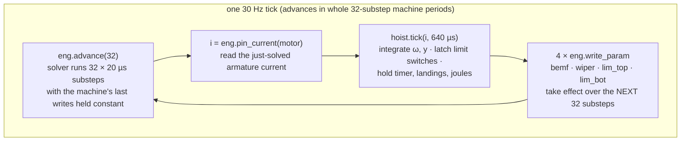

# As built: co-simulation, machines, and damage

*Status: describes `crates/machine`, `crates/damage`, the machine half of
`crates/server`, and the client's chip presentation at commit `0475bbf` (main,
August 2026). None of this exists in the 29 July `arch_*.md` docs — the machine
layer is entirely post-plan architecture; the divergences section at the end says
exactly how.*

---

## 1. The co-simulation boundary

**Problem.** The Freight Hoist needs mechanics — a rotor with inertia, a crate
under gravity, limit switches — and the solver must not contain them. Putting a
mechanism inside sim-core would add non-electrical state to every determinism hash,
grow the engine's device zoo with things that aren't devices, and entangle the one
crate that must stay pure computation.

**Mechanism.** The hoist is split exactly at the electrical terminals:

- The **electrical half** is one ordinary MNA element, `ElementKind::Motor
  { ohms, henries, bemf }`, stamped as a branch equation
  `v0 − v1 − (R + L/h)·i = bemf − (L/h)·i_prev`. Its inductive term is integrated
  backward-Euler *unconditionally*, because the armature pole (L/R = 1.5 mH / 2 Ω
  = 0.75 ms) is stiff next to the machine tick and trapezoidal would ring against
  it. Crucially, `bemf` is an **input parameter**, not state: sim-core owns no
  mechanical state and only ever sees a voltage.
- The **mechanical half** is `crates/machine`: exactly two state variables — rotor
  speed ω and platform height y — plus goal bookkeeping. The ODE is
  `J·dω/dt = K·i − m·g·r − b·ω`, `dy/dt = r·ω`, explicit Euler, with an inelastic
  floor stop, a head stop, and hysteretic limit-switch latching (close at the trip
  height, release 2 mm later, "so a hovering crate cannot chatter the topology").
  The crate header states the design position: *there is no physics engine here
  and none is wanted; y and ω are integrals of a solver unknown, which is what
  makes the goal measured rather than asserted.* The crate obeys sim-core's purity
  rules — no I/O, no clocks, no RNG, no `mul_add`, no transcendentals; only exact
  IEEE-754 operations, so native and wasm32 agree bit-for-bit.

What crosses the boundary is only numbers, in only one direction at a time:

- **Solver → machine:** one solved branch current (`pin_current` on the motor —
  already an unknown in the solved vector), plus per-source power for the energy
  meter.
- **Machine → solver:** four `ParamWrite`s — `Bemf` on the motor, `Wiper` on the
  height-sensor pot, `Switch` on each limit switch. Every one is a real electrical
  quantity of a real element in the document. The four fixture elements (reserved
  ids 900–903) are ordinary parts a player wires to like any other; probes,
  damage, audio, and the client need no concept of "machine" to work with them.

## 2. The coupling loop, exactly as built

Constants (`crates/server/src/main.rs`): `DT = 20 µs`, `TICK_HZ = 30`,
`MACHINE_SUBSTEPS = 32` → the machine integrates with `MACHINE_H = 640 µs` steps,
~1.56 kHz.

This is a staggered explicit exchange: each side sees the other's values one
machine period late. (Calling it "Gauss–Seidel-style" is this doc's
characterization, not the code's.) The delay is harmless because of the rate
analysis below.

Ordering and consistency rules, all enforced in the tick loop:

- **A quarantined solver freezes the machine with it.** The machine tick is
  guarded on engine health — a quarantined solver has no current to report, and
  the mechanism must not coast on stale numbers.
- **Machine *moves* (a player dragging the chip) can never interleave with machine
  ticks** — the same task owns both, and moves drain in the command phase before
  the advance loop, gated like any other mutation.
- **Telemetry can't touch the latches.** The broadcast reads `sensors()`, which
  recomputes outputs *without* moving the hysteresis state; `tick` is the only
  thing allowed to latch. And the broadcast current is seeded from the netlist
  before the loop, so a tick that quarantines immediately still reports the last
  honest reading rather than zero.
- **The document keeps up.** After the loop, the tick's final writes are mirrored
  into the stored document (wiper, both switch positions) so joins and checkpoints
  carry the fixture's real state.

### Why `write_param` is deliberately not `interact()`

`interact`/`compile` clear quarantine and re-arm the 2 backward-Euler event steps —
correct for a world event a player caused, fatal at machine rates. The in-code
argument is exact: clearing quarantine at 1.5 kHz "would resurrect a diverged
circuit every 640 µs and hide the failure forever; re-arming BE would silently keep
the integrator in first order." So `write_param` never touches the health flags,
even when a `Switch` write forces a full recompile (the flags are carried across).
The variants form a cost ladder, which is what makes kHz coupling affordable:

| variant | cost | why |
|---|---|---|
| `Bemf` | free | RHS-only; the b vector is rebuilt every substep anyway; can never make the matrix singular |
| `Wiper` | drop the LU factor | conductances change, topology doesn't; clamped into (0, 1) so the pot stays two finite resistances; no-op writes skipped |
| `Switch` | full recompile | branch-unknown count changes; only when the position actually differs — hysteresis makes that rare |

### The one deliberate hole in "every mutation is gated"

These four writes are the **only** live-netlist mutations that skip the placement
gate. The code's reasons: the mechanism is not a player action, and there is no
honest way to refuse one — refusing a limit-switch write "would leave the crate at
the top with LIM-TOP saying otherwise, which is a lie about the world"; and the
gate costs ~1 ms (an in-code figure, not re-measured here) against a 1.5 kHz write
rate. The guarantee is *relocated to placement time*: the gate factors and trials
every document with **all switches forced closed**, so anything the mechanism can
do to the topology has already been tried before the document was accepted. This
matters precisely because machine writes never clear quarantine: without the
all-closed trial, a wire across LIM-TOP would let the machine's own switch closure
freeze the room on the way up — "the one failure the game inflicts on a document it
blessed." (`validate.rs` records "measured: a wire across LIM-TOP deadlocks until
deleted" — an in-code record; a regression test in the sim-core suite exercises the
scenario.) What stays ungated is bounded by construction: `Bemf` is RHS-only,
`Wiper` is clamped.

## 3. Why 32 substeps — the rate and stability

**The boundary is drawn exactly on the timescale gap.** The motor's *fast*
dynamics (the 0.75 ms armature pole) never cross the boundary: R and L are stamped
in the matrix and integrated at 20 µs. Only the *slow* mechanical state crosses,
and its time constant is τ_mech = J/(K²/R + b) = 7.8e-4/(0.25²/2 + 2e-4) ≈ 24.8 ms.
The 640 µs machine step is 39× inside that — the in-code comment computes the same
ratio as the per-step loop gain through back-EMF (h·K²/(R·J) ≈ 0.026) and calls
explicit Euler stable at it, with margin.

What would break at other rates (reasoned from the constants; not separately
measured):

- **Slower** (larger `MACHINE_SUBSTEPS`): the machine step walks toward τ_mech.
  Explicit Euler on a decay becomes oscillatory at h = τ and divergent at h = 2τ,
  and before that the staggered exchange — each side one period late — adds phase
  lag that rings. The one-period delay is only harmless because h/τ ≈ 0.026 ≪ 1.
- **Faster:** buys nothing dynamically (no mechanical pole is faster than τ_mech;
  the fast pole already lives inside the solver) and pays per-period costs — a
  `pin_current` scan, four writes, and a refactor whenever the wiper moved.
- **Off-grid:** 32 = 2 × 16 = 8 × 4 interlocks with the probe (16-substep) and
  audio (4-substep) cadences, and the tick advances only in whole machine periods
  — every stream lands on exact common sim times, so no drift accumulates into
  sample timestamps.

## 4. The goal is measured, not asserted

Win detection: hold the platform in the painted 300–340 mm band for 5 continuous
seconds; out-of-band time drains the timer 3× as fast; hard landings (touchdown
above 0.8 m/s) are counted; the energy meter integrates the player's *solved*
source power (sinking sources earn no refund; guarded finite, because a legacy ±inf
would serialize as JSON `null` and silently discard the saved room).

This subsystem carries the repo's cautionary tale about documentation. The goal
card used to claim "a constant voltage cannot hold the band." That is measurably
false: V₀ = m·g·r·R/K = 1.88352 V balances gravity, and ω = 0 is asymptotically
stable, so a constant 1.88 V *wins*. What a constant voltage cannot do is **choose
the height** — height is the integral of speed, so open loop parks the crate at
whatever height it happens to reach; feedback is what *finds* the band. The
corrected statement now lives in three places (machine crate, server goal text,
client hoist header) and is pinned by the server test
`the_balance_voltage_holds_the_band_open_loop`, which passes at this commit (run
for this doc, August 2026).

The nameplate chain is closed against the same disease: the motor's advertised
maximum current is *read from the damage table* (`motor_i_max`), rides the machine
message as `imax`, and the client engraves the received value — the plate can never
promise a limit the model does not enforce. The lesson it teaches is real: at 12 V
the stalled armature draws V/R = 6 A, twice the 3 A rating, and the damage model
kills the motor in about 1.7 s (τ·ln(load²/(load²−1)) with load 2; the damage suite
asserts stall death < 3 s).

## 5. Machines as chips (the client half)

**Problem.** How should a machine *look* on a schematic canvas without becoming a
special thing the renderer, hit-testing, probes, and damage all need to know about?

**Mechanism.** A machine is drawn as a **package**: pins on legs outside a body —
deliberately the 555's visual grammar — with only the interior different: live
physics, plus internal bond leads tying each moving part to the leg the player
wires. Properties worth knowing because each kills a bug class:

- **Geometry is measured, not declared.** A leg spec names only element+pin+label;
  its *position* is read from the child element's own pins in the document. The
  previous version declared sizes "with a comment saying they had to match the
  server's. They did not have to: nothing checked" — legs drifted off terminals.
  Now a machine *cannot* put a leg anywhere but on its terminal.
- **No single potential.** Each leg is stroked in the solver's voltage color for
  *its* pin; the body is neutral — the same principle as the schematic LOD band
  (see [`asbuilt_client.md`](asbuilt_client.md)). Current dots per leg read that
  leg's own element frame. The chip is "a VIEW over four ordinary elements."
- **The interior draws only server numbers.** Crate at `y`, sensor tap at the
  exact `wiper` value written into the solver (not derived from y — the two differ
  at the end stops, and drawing the tap from y "would be a small lie about what
  the pot sees"), limit blocks at their true trip heights. The client animator's
  contract forbids invention: everything it produces is a function of the messages
  and the frame clock.
- **The datasheet prints measurements or admits it can't.** The pinout used to
  print `wiper × 5 V` as if measured — with a 1 kΩ load it said 2.40 V while a
  probe on the same node read 1.00 V, because a loaded pot is not an ideal
  divider. Now every terminal row prints the solver's measurement (null → "—",
  never a fabricated zero), and constants may be printed only *as* constants.
- **Server-owned fixtures:** ids 900–999 are reserved; every client doc-op on them
  is refused; the assembly moves only as a whole, through the gated machine-move
  path; hostile deltas are dropped, never panicking.

### The second-machine seam — two seams, different maturity

Be precise here, because the code is honest about it:

- **Client seam: built and proven.** `machines/seam.ts` defines a deliberately
  generic message (a one-degree-of-freedom carriage with travel limits, a goal
  band, an end-stop pair, a position sensor) and a `MachineDef` contract;
  `machines/index.ts` is the registry. The claim — one module plus one registry
  line buys full presentation, drag, hit-test, pinout, damage, LOD — is proven by
  `machines/conveyor.ts`, a second *presentation* over the same mechanism,
  reachable only via a dev flag. Its header is admirably honest: a genuinely
  second *mechanism* "additionally needs the server's one-machine assumption
  lifted."
- **Server seam: half-built.** `MachineDef { kind, w, h, fixtures }` exists and
  the fixture/move/validation helpers are written against it — the doc comment
  spells out what a machine-as-assembly *is* (reserved child ids, a footprint, a
  terminal map derived from the rect, per-instance state carried across moves).
  But the rest is still singleton-shaped: `MachineSpec` knows only
  `None | Hoist`, the sim task destructures a concrete `Hoist`, and
  `machine_step`/`machine_msg` hardcode the hoist's ids and write shape. Several
  helpers carry the literal comment "the room's single machine, for the call
  sites that predate the seam." There is no server-side conveyor at all.

## 6. Damage

**Problem.** Parts must fail — overload is the game's central teaching mechanism —
but a per-element thermal field inside sim-core would put non-electrical state into
every determinism hash, and any client-side judgment would violate pillar 1.

**Mechanism, split across three owners:**

- **sim-core owns one verb:** `set_broken`. A broken part stamps nothing, owns no
  branch, merges no nodes, reports exactly zero current, and its pins remain
  junctions — "a dead part is a gap, not a hole in the netlist." A dead LED even
  hands back the linear fast path. `set_broken` is a world event through the full
  compile path — it legitimately clears quarantine and re-arms BE ("the circuit
  really did change"), and resets the part's continuous state in both directions:
  a part that has released its magic smoke has no charge left, and a repaired one
  is a new part out of the drawer.
- **`crates/damage` owns the decision.** Input is the tick's element frames — the
  same frames the room broadcasts, so *every number it reads is a solver output*.
  Each breakable part has a `Rating { metric, limit, tau }`; `load =
  metric/limit`; heat is `load` for power-rated parts and `load²` for
  current/voltage-rated ones ("because that is what i²R is" — with the stated
  consequence that periodic waveforms settle at mean power, not crest-punished).
  Stress is a normalized temperature: `ds/dt = (heat − s)/τ`, break at s ≥ 1,
  integrated with the ODE's **exact solution** — exact rather than Euler because
  the caller's step (a 33 ms tick) is not small next to the fastest τ (an LED's
  0.35 s), and a 1000× overload must break the part, not the integrator.
  Closed-form time-to-break τ·ln(heat/(heat−1)) is asserted by tests. Non-finite
  solver output (an ideal short's inf) reads as *infinite overload*, never as the
  silent zero `f64::max(NaN)` would produce. Broken parts stop integrating — a
  dead part must not cool its way back to health; `repair` is a world event, not
  an undoable document edit, and the server clears both halves together (model
  bookkeeping and `set_broken(false)`) because clearing one leaves a part that
  reads healthy and conducts nothing, or vice versa.
- **The server owns the loop.** One `frame()` sweep per tick feeds damage and the
  broadcast; damage integrates over the sim time the solver *actually* advanced —
  a budget-limited tick cooks proportionally less, and a quarantined tick cooks
  nothing ("a frozen circuit cannot cook a part"). Clients receive `[id, stress,
  broken]` (dead parts first, capped at 512 rows) and render heat and smoke; they
  decide nothing.

**Ratings are per-instance tiers, not per-kind.** A tier is a rung on a
per-kind ladder (`tiers`/`rating` in the damage crate): tier 0 is "the opening
kit… deliberately feeble"; tier 1 ships a 5 W wirewound resistor, a TO-220 power
MOSFET ("the part that makes the hoist solvable at all"), 14 AWG wire. `tier` and
`rot` are structurally prevented from mattering electrically — neither may reach a
stamp, so neither can change a hash or a matrix entry — and the validator bounds
them syntactically. Wire is rated (3 A at tier 0) with a stated caveat: wire
current comes from KCL recovery, which can't resolve every wire, and unresolved
wires read 0 A and never break — it under-reports, never over-reports; fails safe.
The starter-kit numbers are argued physically in a long comment block and pinned by
a test named `the_starting_kit_teaches_the_classic_lessons` (LED without a
resistor dies in a tick while the battery barely warms; a 1 A toggle welds on the
hoist's inrush — "switch the motor directly must not work"; the op-amp became
breakable only after its reported power was made honest upstream). The damage suite
passes at this commit (run August 2026).

## Divergence from the 29 July plan

- **Co-simulation appears nowhere in the plan.** `arch_sim-engine.md` planned the
  DC motor as a self-contained back-EMF companion *device* inside the engine;
  `arch_frontend.md` treated rotor angle as a client visual integrated from a
  snapshot field. The machine crate, fixture assembly, `MachineDef`, chip
  presentation, goal, and repair verb are all post-plan.
- **Damage moved out of the engine.** `arch_sim-engine.md` §5 placed damage
  physics inside sim-core's commit phase, with trip-to-open/short and parameter
  drift. As built: a separate crate outside the solve path (to protect the
  determinism hashes), breaking is always *open*, there is no fuse/breaker device
  and no drift, and per-instance tiers are new. The planned "fuse (i²t)" survives
  transformed: i²t became the universal squared-heat-law stress ODE.
- `arch_frontend.md`'s world-band faceplates and particle smoke remain future; the
  built equivalents are the chip interior and the heat-glow/broken-X overlays.
