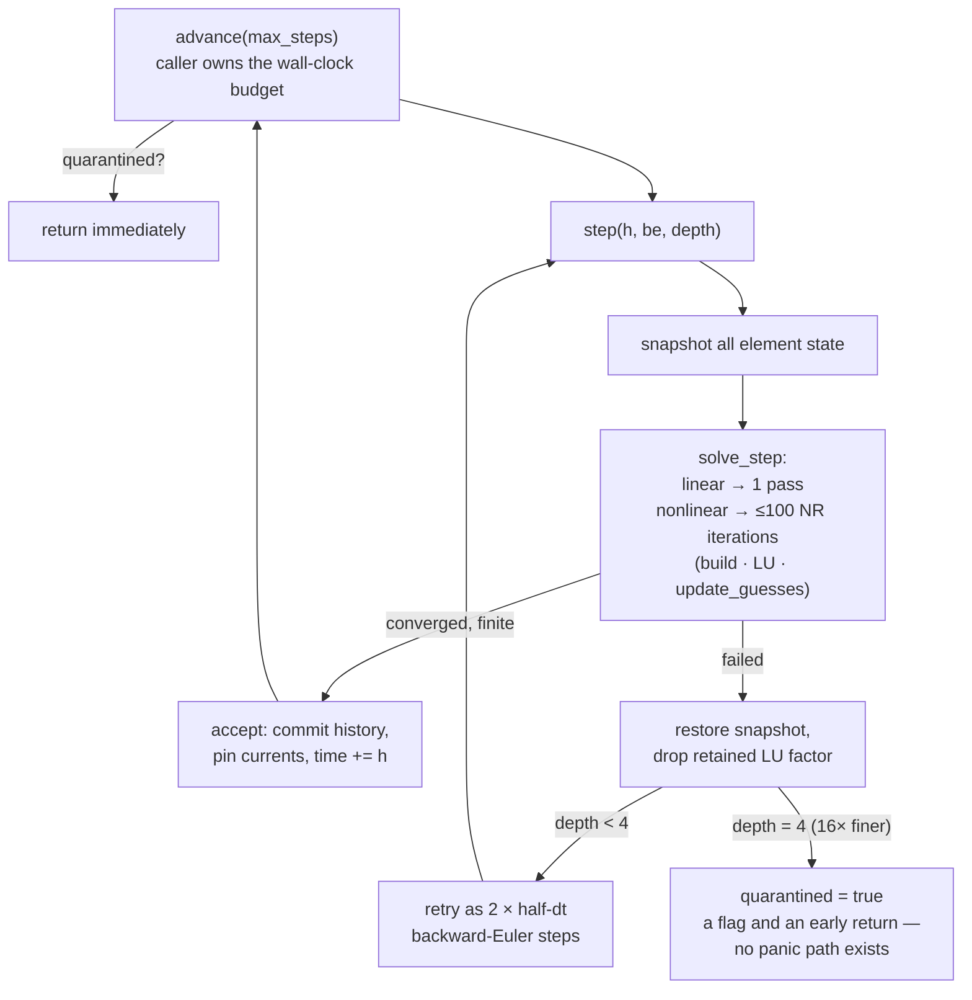

# As built: the solver — from a drawing to a matrix and back

*Status: describes `crates/sim-math` and `crates/sim-core` at commit `0475bbf`
(main, August 2026). Companion to the planned design in `arch_sim-engine.md`
(29 July); divergences are called out in place. Measured numbers state their
source; a few are in-code records of past measurements and are marked as such.*

The solver's job: take a bag of parts and wires a player drew, turn it into a
system of equations, advance it 50 000 times per simulated second, and never lie,
stall, or panic while doing it. This doc walks that pipeline in order, leading each
section with the problem it solves.

---

## 1. The numeric bedrock: a deliberately boring LU (`sim-math`)

**Problem.** The same solver must produce *bit-identical* results compiled natively
on the server and to wasm32 in the browser (see
[`asbuilt_determinism-scale.md`](asbuilt_determinism-scale.md) for why that is
non-negotiable). Almost every performance trick a linear-algebra library reaches
for — FMA, SIMD, reduction reordering, platform libm — breaks that.

**Mechanism.** One dense LU factorization with partial pivoting, written as plain
scalar f64 loops, because plain scalar `+ - * /` is exactly specified by IEEE-754
on every target. The crate header bans the rest by name. Correctness is anchored by
a differential test against `faer` (dev-dependency only) on 400 random systems,
including row-rotated ones that force pivoting on every step — the comment notes
MNA voltage-source rows look exactly like that. Two details matter architecturally:

- `PIVOT_TOL = 1e-30`: a pivot below it means "singular", reported as a `bool`,
  never a panic. Healthy circuits sit far away because every node carries a GMIN
  leak (§3).
- **The zero-multiplier skip**: a row update is skipped when the elimination
  multiplier is exactly `0.0`. This one branch is load-bearing for the whole game:
  a world of many *disconnected* circuits produces a block-diagonal matrix, and the
  skip lets the dense factor walk straight past the empty blocks — which is why one
  world-sized matrix has remained survivable this long (`docs/scale-baseline.md`
  credits it by name).

**Cost / limits.** Dense is O(n³); the crate comment says it serves n < ~150 with a
sparse solver planned for larger islands. Treat that as aspiration text, not a
promise: no sparse solver exists in the shipping crates (a prototype lives outside
the workspace, per `docs/scale-parallelism.md`), and the *measured* real-time
boundary arrives earlier than 150 unknowns for nonlinear circuits (see the scale
doc).

---

## 2. From drawing to matrix: the compile pipeline

**Problem.** Players don't draw netlists; they drop parts whose pins are integer
grid points and drag wires between them. Something must decide what is electrically
connected — deterministically, in document order, identically on every target — and
turn it into a numbered system of unknowns.

**Mechanism — there is no "net" object.** A net is an emergent equivalence class.
`Engine::compile` runs on every edit, switch flip, knob turn, machine move, and
gate trial:

1. **Junction interning.** Unique pin coordinates are interned in first-seen
   document order via a `BTreeMap` — explicitly not a hash map, because a hasher's
   random seed would make iteration order platform-dependent and break
   determinism. (An in-code note records the previous O(points²) scan measured
   69 µs vs 25 µs on a 400-element room — an in-tree measurement, not re-run for
   this doc.)
2. **Wire closure by union-find.** A `Wire` merges its two endpoints; a `Ground`
   merges its endpoint with a virtual ground root. Coincident pins are the same
   junction; connectivity is whatever shares a grid point transitively. Broken
   elements are skipped — a dead wire must not keep shorting.
3. **Node numbering.** The ground class becomes node 0; every other root is
   numbered 1..N in first-seen order. **Node 0 is not an unknown — it has no row or
   column.** File this fact away: it is the entire mathematical basis for exact
   island decomposition and for the placement gate's per-block trials.
4. **Branch unknowns and the source-merge rule.** Ideal zero-impedance devices
   (voltage sources, rails, closed switches, op-amp/555 outputs, the motor) get a
   branch-current unknown. Before allocating, each ideal constraint is
   canonicalized (`constraint.rs`) into an integer key; **equal keys share one
   branch unknown**. Two 5 V supplies wired in parallel are one net, not a singular
   matrix; so are a supply and a rail of the same value, and two closed switches in
   parallel (two-way lighting). Later members of a group don't stamp (stamping the
   ±1 incidence twice would corrupt it) and record a sign for their drawn
   orientation.

The unknown vector is `[v_node1..v_nodeN, i_branch1..i_branchM]`.

**The merge rule's honesty problem, solved explicitly.** A merged group's total
current is uniquely determined by the physics, but the *split* between the merged
branches is not — the constraint has a one-dimensional null space. `accept()`
divides the total symmetrically across members (the unique permutation-invariant
choice, per the in-code argument); the total is exactly the solver's, and a test
asserts it is preserved. Unmerged elements multiply by exactly 1.0, so no
pre-existing state hash moved when this landed.

**Why quantized keys, never epsilon comparison.** Constraint parameters are
compared by mantissa-truncated integer keys (drop 12 bits ⇒ 2⁻⁴⁰ relative
tolerance). Exact `==` fails on representation noise; an epsilon compare is *not
transitive*, so "same net" would stop being an equivalence relation and which pairs
merged would depend on iteration order — a correctness bug, not an aesthetic one.
Deliberate exclusions: motors never merge (each stamps its own armature term so
*parallel motors are well-posed*); op-amps and 555s never merge (two op-amps
driving one node is a design error, not a net). A source's `phase` is deliberately
not reduced mod 2π — that would put an f64 approximation of an irrational on a
determinism-policed path; the cost is a rare fail-safe refusal to merge.

**What breaks without all this.** Without the merge rule, the most natural beginner
move — paralleling two batteries — is a singular matrix and a frozen room. Without
document-ordered interning, the same drawing compiles to different node numberings
on different targets, and every hash, wire message, and replay diverges.

**Every compile is also a reset.** Compile clears `quarantined` and arms 2
backward-Euler steps: a solver that diverged on the old topology deserves a fresh
start on the new one. This is the deliberate contrast with `write_param`, which
must *not* do either — see
[`asbuilt_cosim-machines.md`](asbuilt_cosim-machines.md).

---

## 3. Stamping, GMIN, and device models with game design in the constants

**Problem.** Players build half-finished, floating, dangling circuits *constantly*.
A textbook MNA solver rejects them as singular.

**Mechanism.** Every node diagonal gets a `GMIN = 1e-12` S leak to ground, so
floating subgraphs stay solvable — the "beginner-tolerant solver." The placement
gate deliberately *accepts* floating subgraphs and dangling current sources for the
same reason. Capacitors and inductors become companion models (conductance +
history current) with trapezoidal and backward-Euler variants chosen per step.

The device constants are game-design decisions with stated reasons, not tuning
accidents (all in `engine.rs`/`netlist.rs` with their arguments attached):

- **Op-amp:** gain 1e5 *plus a 100 µV input offset* — an ideal offset-free op-amp
  in positive feedback has an exact metastable solution that a noiseless
  deterministic solver would sit on forever; the offset is what lets relaxation
  oscillators self-start. Output current folds back at `isc` (defaults to the
  741's 25 mA) because without it the part is an unlimited current source and
  "op-amp straight into a motor" would work, which it must not.
- **MOSFET:** avalanche clamp at 55 V, gated to be *structurally zero* 40
  e-foldings below breakdown so sub-60 V circuits don't change by one bit. This is
  the reason an inductive turn-off has a solution at all: without it, switching a
  motor off through an off-state FET quarantines the room with no diagnosis; with
  it, the energy lands in the FET, the FET cooks, and the fix the player discovers
  (a freewheel diode) is the real fix.
- **555:** an RS latch as discrete state; thresholds track the *live* supply (a
  sagging rail moves both comparators); the totem-pole output returns current to
  the supply pin it works against, so the output current actually comes out of the
  battery.
- **Noise source:** counter-based SplitMix64 over (seed, index) — integer-only, so
  it is deterministic; drawn once per step *before* the NR loop and held, because a
  source that moved under Newton's feet would never converge; RHS-only, so it
  never forces a refactor.
- **Power honesty:** the op-amp's Σv·i is power *delivered*, not burned (the ideal
  model has no supply pins), so its dissipation is computed as
  `|i_out|·(rail − sign(i_out)·v_out)` — the "every number comes from the solver"
  pillar enforced inside a single formula. Its quiescent current is deliberately
  not charged, because no solver node supplies it.

---

## 4. The step loop: Newton, TR/BE, the rescue ladder, quarantine

**Problem.** Nonlinear circuits sometimes refuse to converge, and a shared
multiplayer room cannot crash, hang, or silently produce garbage when they do.

**Mechanism.** Constants: `NR_MAX_ITERS = 100`, convergence tolerance
`|Δ| < 1e-6 + 1e-3·max`, `RESCUE_DEPTH = 4`, `BE_STEPS_AFTER_EVENT = 2`.

Load-bearing details:

- **`advance` takes a step count, never a deadline** — "Falstad's rule: heavy
  circuits slow sim time, never the UI" is enforced by this signature. The caller
  (server tick / client frame) converts wall time to a budget.
- **Rescue retries are backward Euler**, doubly motivated: BE is robust against
  both nonconvergence and trapezoidal ringing. The rollback also restores the
  noise stream and drops any retained LU factorization (the region set it
  described may no longer exist) — even on the give-up path, because a live
  `write_param` can resume stepping a quarantined engine.
- **Convergence limiting** is per-device: SPICE-style `pnjlim` on junctions
  (log-damped steps past vcrit so `exp` can't overflow); MOSFETs damp at
  ±0.5 V/iteration *except* in the breakdown direction, which is pnjlim'd so an
  inductive turn-off can move the drain fifty volts in one pass — the in-code
  comment records that the 0.5 V crawl is precisely why unclamped turn-off used to
  diverge.
- **Discrete devices get a flip budget.** Op-amp regions and the 555 latch may
  flip at most twice per NR pass: at an exact threshold crossing, two states can
  point at each other forever; holding the current one yields a consistent solve
  that the next substep's capacitor motion resolves. Region transitions are
  asymmetric on purpose — a railed op-amp with opposing drive flips *directly* to
  the other rail (routing through linear would chatter every Schmitt trigger), but
  a current-limited one relaxes to linear first (jumping to the opposite limit
  would chatter a marginally-overloaded follower).
- **Integration policy:** trapezoidal normally; the first 2 steps after any
  compile are BE to kill TR ringing off the discontinuity; rescue retries are BE;
  the motor's inductive term is BE *always* (its L/R = 0.75 ms pole is stiff
  against the machine tick and TR would ring against it).
- **Broken parts store zero currents** on accept, so no display can ever show a
  stale reading from before the part died.

**What breaks without it.** Remove the ladder and any hard turn-off transient
quarantines rooms that a 16×-finer step would have survived. Remove quarantine's
stickiness and a diverged room flails forever at full budget. Replace the flag with
a panic and one player's circuit takes down the process hosting everyone's.

---

## 5. Piecewise-linear factor reuse (merged)

**Problem.** One nonlinear device used to make the whole world re-stamp and
re-factor the matrix on *every NR iteration of every substep* — measured at 60–95 %
of substep cost in the scale baseline. But the most popular "nonlinear" parts in
this game — op-amps and 555s — aren't smoothly nonlinear at all.

**Mechanism.** `is_nonlinear` splits into two classes in `netlist.rs`:

- `is_discrete_nonlinear` (op-amp, 555): the stamp is a function of a *discrete*
  state — rail region, RS latch — never of the solution vector, time, or
  continuous history. Between flips the matrix is literally constant, so last
  substep's LU **is** the factorization of this substep's matrix, bit for bit.
- `needs_newton` (diode, zener, LED, BJT, MOSFET, OTA): smooth `exp`/`tanh`
  conductances; the matrix moves every pass; nothing is reusable.

The engine reuses the retained factorization whenever no smooth-nonlinear device is
live, and invalidates it only when a region or latch **actually flips** — "that,
and only that, is the 'event' in event-driven." The factorization is keyed on
(h, be) so a BE event step can't reuse a TR factor, and is also dropped by rescue
rollback and by `Wiper` parameter writes. Because the matrix is *not* re-zeroed on
a reuse hit, every matrix write in the op-amp/555 stamps is guarded by
`need_factor`, while the RHS is rebuilt every pass unconditionally — that guard
discipline is the invariant that makes reuse correct.

**Fail-safe by derivation.** `needs_newton` is *derived* —
`is_nonlinear() && !is_discrete_nonlinear()` — rather than being a third
hand-maintained list. A new nonlinear device whose author forgets to classify it
lands on the safe side: treated as smooth, forfeiting reuse, costing speed and
never correctness. The honesty harness makes that stick:
`sim-golden/tests/pwl_reuse.rs` runs every golden circuit with reuse on and off and
asserts bit-identical state hashes *and* raw matrix bits.

**Measured** (Apple M4, release, medians of 5 runs — `docs/scale-baseline.md`,
recorded July 2026): a 555 astable at 480 Hz flips 957 times per simulated second
against 50 000 substeps, so 98.1 % of substeps reuse. Room scale: 555+room went
1.89× → 5.08× real time (≈2.7×); a Schmitt oscillator room 2.03× → 5.35×; the
largest 555 room holding real time doubled, 243 → 486 elements. Honest non-win,
also measured: one LED in the room and the gain collapses to nothing (1.70× →
1.71×) — correctly, because freezing a diode's conductance would approximate the
physics, and this optimization refuses to approximate anything.

---

## 6. What the engine exposes upward

For the layers above (server tick, machines, damage, audio, the gate), the engine's
surface is small and each entry point encodes a policy decision:

| entry point | policy it encodes |
|---|---|
| `advance(max_steps)` | the caller owns wall time; the engine owns sim time |
| `interact(...)` / `set_elements(...)` | world events: full recompile, quarantine cleared, BE re-armed |
| `write_param(...)` | machine-rate writes: *never* clears quarantine, cost tiered by variant — see [`asbuilt_cosim-machines.md`](asbuilt_cosim-machines.md) |
| `set_broken(id, bool)` | the one damage mechanism sim-core owns: the part stamps nothing (failed **open**); full recompile both ways — see [`asbuilt_cosim-machines.md`](asbuilt_cosim-machines.md) |
| `probe_solvable()` | stamp + factor without advancing state; clears the retained factor before *and* after so it can never answer from a cache — the gate's layer 3 |
| `pin_current` / `ElemTap` | O(1)-per-sample taps for the co-sim read and 12.5 kHz audio; invalidated taps read silent zero, never panic |
| `state_hash()` | xxh3 over NaN-canonicalized state — the determinism harness's oracle; new state (broken ids, noise counters) hashes only when present, precisely so historical golden hashes never moved |
| `check_document(...)` (`validate.rs`) | the placement gate — a pure function, same binary logic on server and client; see [`asbuilt_authority.md`](asbuilt_authority.md) |

## Divergence from `arch_sim-engine.md` (the plan)

- Planned crates `sim-digital`, `sim-probe`, `sim-api`, `sim-native` do not exist;
  their live subset (taps, params, validation) grew inside `sim-core`'s API
  instead.
- No sparse LU, no AMD ordering, no Bergeron transmission-line island boundaries,
  no subcircuit flattening, no MCU/event layer. Islands exist only as mathematics
  inside the gate (per-block trials) and as benchmark harnesses.
- The plan's "no ground required; each island elects a reference" became: ground
  symbols merge into node 0, and GMIN keeps unreferenced subgraphs solvable.
- The plan's DRC ("named diagnostics, not failures") hardened into the placement
  gate's *refusals* — stricter than planned, and the code argues why.
- The motor is **not** a nonlinear device (a claim `scale-parallelism.md` corrects
  in itself): it is a branch device whose back-EMF is an RHS-only parameter — the
  co-simulation boundary, which the plan did not anticipate.
